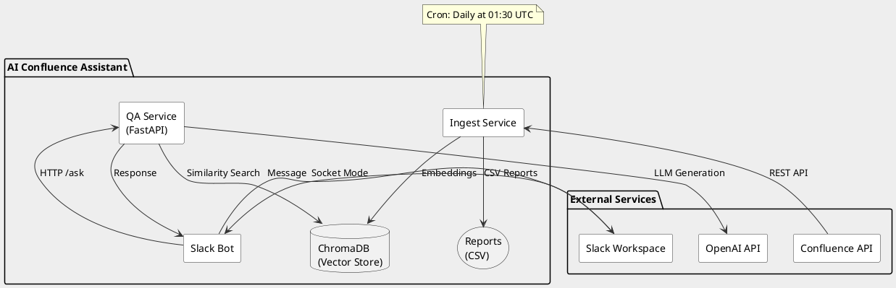

# Архитектура AI Confluence Assistant

## Обзор системы

AI Confluence Assistant - это система для интеллектуального поиска и ответов на вопросы по документации Confluence через Slack-интерфейс.

## Компоненты системы

### 1. Ingest Service
- **Назначение**: Выгрузка и индексация документации из Confluence
- **Технологии**: Python, atlassian-python-api, ChromaDB, LangChain
- **Запуск**: По расписанию (cron) или вручную

### 2. QA Service
- **Назначение**: REST API для обработки вопросов и генерации ответов
- **Технологии**: FastAPI, LangChain, OpenAI API
- **Порт**: 8000

### 3. Slack Bot
- **Назначение**: Интерфейс для пользователей через Slack
- **Технологии**: Slack Bolt (Socket Mode)
- **Команды**: `ask <вопрос>`

### 4. Vector Store (ChromaDB)
- **Назначение**: Хранение эмбеддингов документации
- **Расположение**: ./vector_store

## Диаграмма архитектуры



## Поток данных

### 1. Индексация документации
```
Confluence → Ingest Service → Text Processing → Embeddings → ChromaDB
                            ↓
                        CSV Reports
```

### 2. Обработка вопросов
```
User → Slack → Bot → QA Service → ChromaDB (поиск)
                                → OpenAI (генерация)
                   ← Response ←
```

## Безопасность

### Аутентификация
- **Confluence**: API Token
- **Slack**: Bot Token + App Token
- **OpenAI**: API Key

### Сетевая безопасность
- Все сервисы работают в изолированной Docker-сети
- Только QA Service экспонирует порт наружу (8000)
- Slack Bot использует Socket Mode (без webhook)

## Масштабирование

### Горизонтальное масштабирование
- **QA Service**: Можно запустить несколько экземпляров за балансировщиком
- **Slack Bot**: Один экземпляр (ограничение Socket Mode)

### Вертикальное масштабирование
- **ChromaDB**: Миграция на Postgres-backed версию
- **Embeddings**: Использование GPU для ускорения

## Мониторинг

### Health Checks
- QA Service: GET /health
- Docker: встроенные health checks

### Логирование
- Все сервисы: структурированные логи в stdout
- Уровни: DEBUG, INFO, WARNING, ERROR

### Метрики
- Количество проиндексированных страниц
- Количество пропущенных страниц
- Время ответа на запросы
- Количество обработанных вопросов

## Disaster Recovery

### Backup
- ChromaDB: ежедневный backup vector_store/
- Reports: сохранение в GitHub Actions artifacts

### Восстановление
1. Восстановить vector_store/ из backup
2. Или перезапустить полную индексацию

## Развертывание

### Docker Compose (рекомендуется)
```bash
docker compose up -d api bot
docker compose --profile scheduler up -d  # для cron
```

### Kubernetes (опционально)
- Helm chart в разработке
- Поддержка ConfigMap/Secrets
- HPA для QA Service

## Будущие компоненты (v2.0)

### Release Tracker
- **Назначение**: Мониторинг и анализ релизов из Slack
- **Технологии**: Slack API (conversations.history)
- **Интеграция**: Сохранение в отдельную БД + ChromaDB

### GitHub Analyzer
- **Назначение**: Анализ Pull Requests и изменений
- **Технологии**: GitHub API v4 (GraphQL), PyGithub
- **Функции**: Парсинг changelog, связывание с релизами

### Release Correlator
- **Назначение**: Сопоставление информации о релизах
- **Технологии**: SQLAlchemy, PostgreSQL
- **Результат**: Единая timeline изменений

Подробнее см. [ROADMAP.md](ROADMAP.md) 